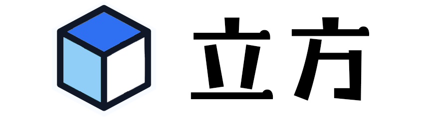

<p align="center">
  
</p>

<p align="center">
  智能魔方的在线练习与成绩分析工具
</p>

<p align="center">
  <a href="https://cube.mwhitelab.com">在线体验</a>
  ·
  <a href="CHANGELOG.md">更新记录</a>
</p>

<p align="center">
  
  
  
  
</p>


## 功能

- 通过 Web Bluetooth 连接 GAN 智能魔方
- 三维魔方同步、计时练习与专项训练
- CFOP 公式浏览、筛选与练习
- 成绩趋势、阶段用时与练习热力图
- 中英文界面与本地数据存档

> [!NOTE]
> 当前仅支持 GAN 智能魔方，建议使用支持 Web Bluetooth 的 Chromium 浏览器访问。

## 本地运行

```bash
npm install
npm run dev
```

打开 [http://localhost:3000](http://localhost:3000)。

## 技术栈

Next.js · React · TypeScript · Three.js · GAN Web Bluetooth

## 致谢

感谢 [afedotov/gan-web-bluetooth](https://github.com/afedotov/gan-web-bluetooth) 提供 GAN 智能魔方的 Web Bluetooth 支持。
