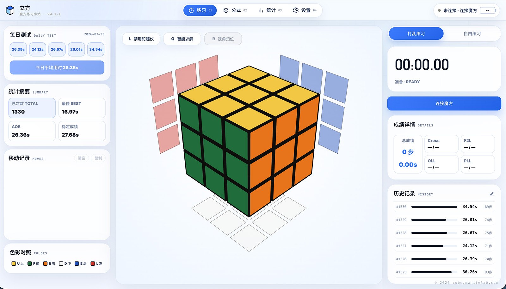

<p align="right">
  <a href="README.md">简体中文</a> | <strong>English</strong>
</p>

<p align="center">
  
</p>

<p align="center">
  Online practice and performance analysis for smart cubes
</p>

<p align="center">
  <a href="https://cube.mwhitelab.com">Try it online</a>
  ·
  <a href="CHANGELOG.md">Changelog</a>
</p>

<p align="center">
  
  
  
  
</p>



## Features

- Connect to GAN smart cubes via Web Bluetooth
- Real-time 3D cube synchronization, timed practice, and targeted drills
- Browse, filter, and practice CFOP algorithms
- Performance trends, solve-stage timing, and practice heatmaps
- Chinese and English interfaces with local data storage

> [!NOTE]
> Currently, only GAN smart cubes are supported. We recommend using a Chromium-based browser with Web Bluetooth support.

## Run locally

```bash
npm install
npm run dev
```

Open [http://localhost:3000](http://localhost:3000).

## Tech stack

Next.js · React · TypeScript · Three.js · GAN Web Bluetooth

## Acknowledgements

Thanks to [afedotov/gan-web-bluetooth](https://github.com/afedotov/gan-web-bluetooth) for providing Web Bluetooth support for GAN smart cubes.
